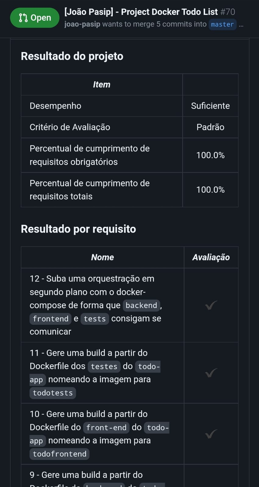

# Projeto Docker Todo List

Nesse projeto eu conteinerizei a aplicação, criei a conexão entre elas e orquestrei o seu funcionamento. Recebi uma aplicação full-stack, aplicativo de tarefas. E, para a aplicação funcionar precisava ser conteinerizada. Desta forma, utilizei uma série de comandos do `docker` com diferentes níveis de complexidade. Toda a pasta todo-app foi feita pela Trybe, meu trabalho foi referente aos entregáveis listados logo abaixo nesse Readme.

## 🛠 Habilidades
Entendimento do que é e os principais comandos `docker` [documentação oficial](https://docs-docker-com.translate.goog/engine/reference/commandline/cli/?_x_tr_sl=en&_x_tr_tl=pt&_x_tr_hl=pt-BR&_x_tr_pto=nui) e `docker-compose`.

## Utilização

- Para clonar o projeto: `git clone git@github.com:joao-pasip/Docker-TodoList.git`.

- Já existe um arquivo `docker-compose.yml`. Bastando usar o comando `docker-compose up -d` para buildar as imagens do Dockerfile disponibilizada pela Trybe e executar em segundo plano o Docker.

## Entregáveis

### 1. Crie um container em modo interativo, sem rodá-lo, nomeando-o como `01container` e utilizando a imagem `alpine` na versão `3.12`

### 2. Inicie o container `01container`

### 3. Liste os containers filtrando pelo nome `01container`

### 4. Execute o comando `cat /etc/os-release` no container `01container` sem se acoplar a ele

### 5. Remova o container `01container`

### 6. Faça o download da imagem `nginx` com a versão `1.21.3-alpine` sem criar ou rodar um container

### 7. Rode um novo container com a imagem  `nginx` com a versão `1.21.3-alpine` em segundo plano nomeando-o como `02images` e mapeando sua porta padrão de acesso para porta `3000` do sistema hospedeiro

### 8. Pare o container `02images` que está em andamento

### 9. Gere uma build a partir do Dockerfile do `back-end` do `todo-app` nomeando a imagem para `todobackend`

### 10. Gere uma build a partir do Dockerfile do `front-end` do `todo-app` nomeando a imagem para `todofrontend`

### 11. Gere uma build a partir do Dockerfile dos `testes` do `todo-app` nomeando a imagem para `todotests`

### 12. Suba uma orquestração em segundo plano com o docker-compose de forma que `backend`, `frontend` e `tests` consigam se comunicar

## Considerações finais

Um projeto feito para aprender a instalação do Docker, a diferença entre imagens e containers, aspectos da arquitetura do Docker, principais comandos para a sua utilização, como rodar imagens do Docker Hub, como gerenciar nosso ambiente de contêineres utilizando a ferramenta Docker Compose, e por que utilizar volumes e também conhecer o recurso de networks no Docker.

